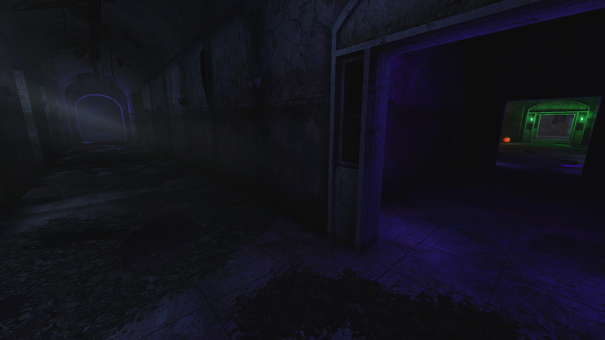
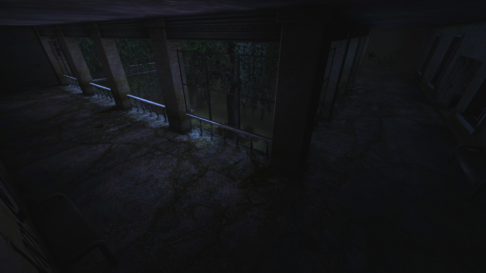
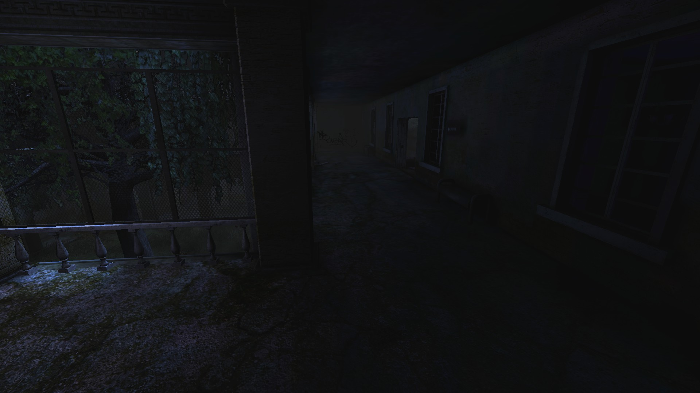
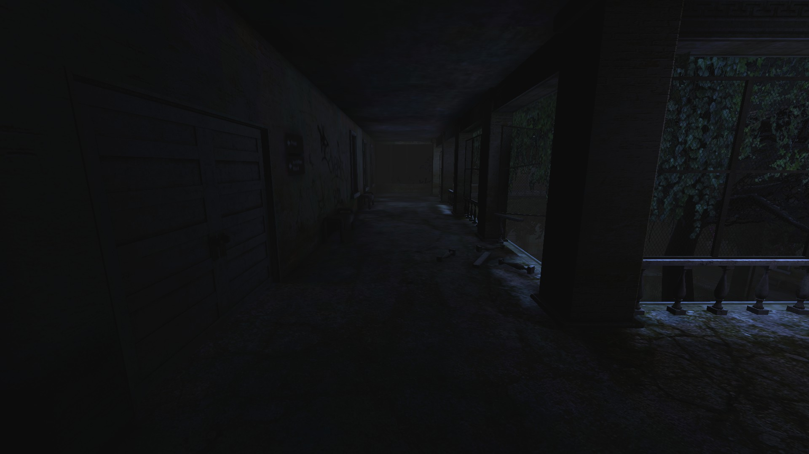

# Holdout Spots on Bedlam

## #1, The classic corner with long hallway

## #2, The 2-way top floor (solo) spot

### Overview

### Right side

### Left side, double door

The left side has double door which can be welded if necessary.
