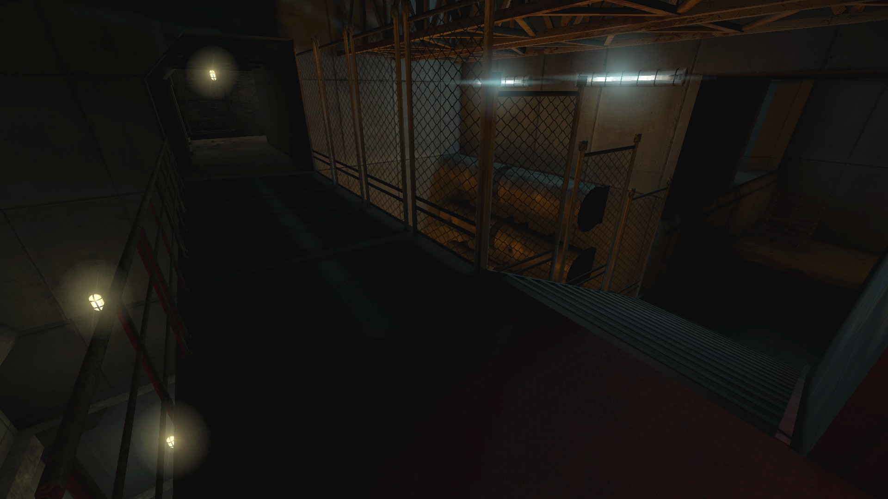
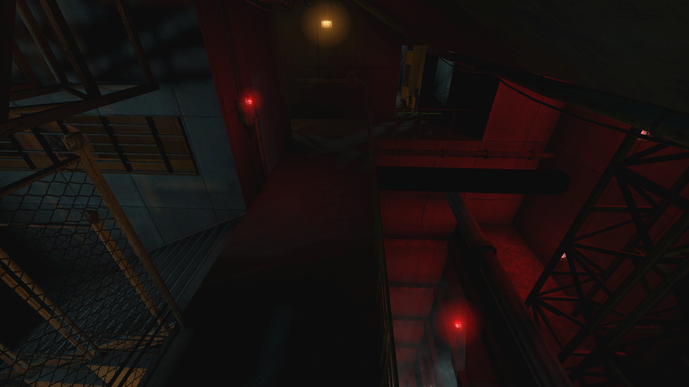
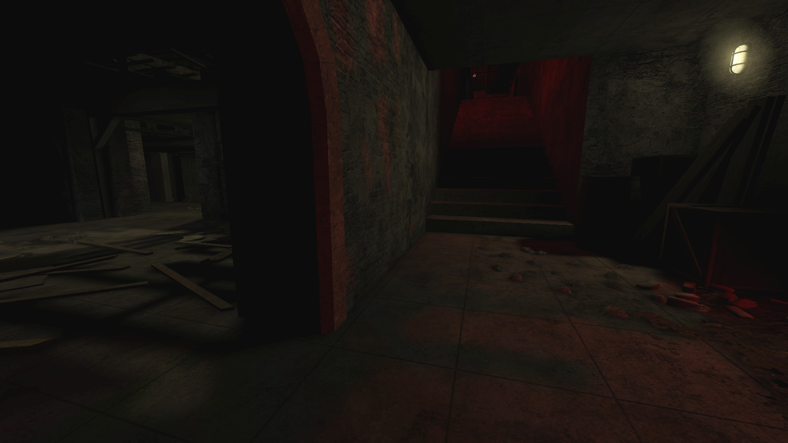
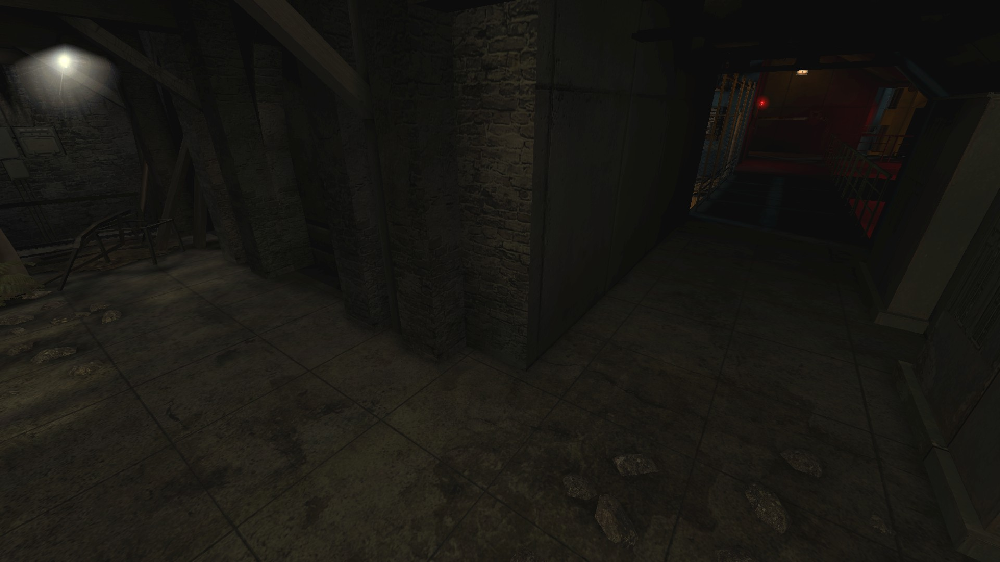
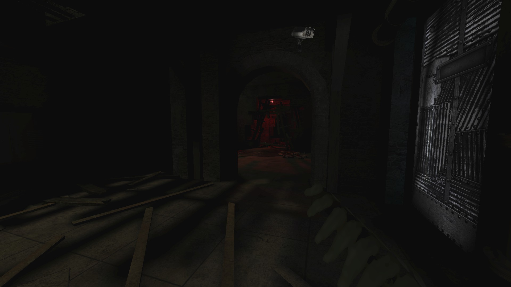

# Holdout Spots on Clandestine

## #1, The (Bridge - Red Staircase) intersection

### Bridge - overview

### Bridge - fork

One of the bridge's ends diverges into 2 sets of stairs.

### Red stairscase

### Connector

A small room connecting the 2 major lanes (Bridge and Red Staircase).

View on the bridge

View on the arch leading to the red-lit staircase

