# Holdout Spots on West London

## #1, The 2-way corner, farthest spot from the spawnpoint

### Overview

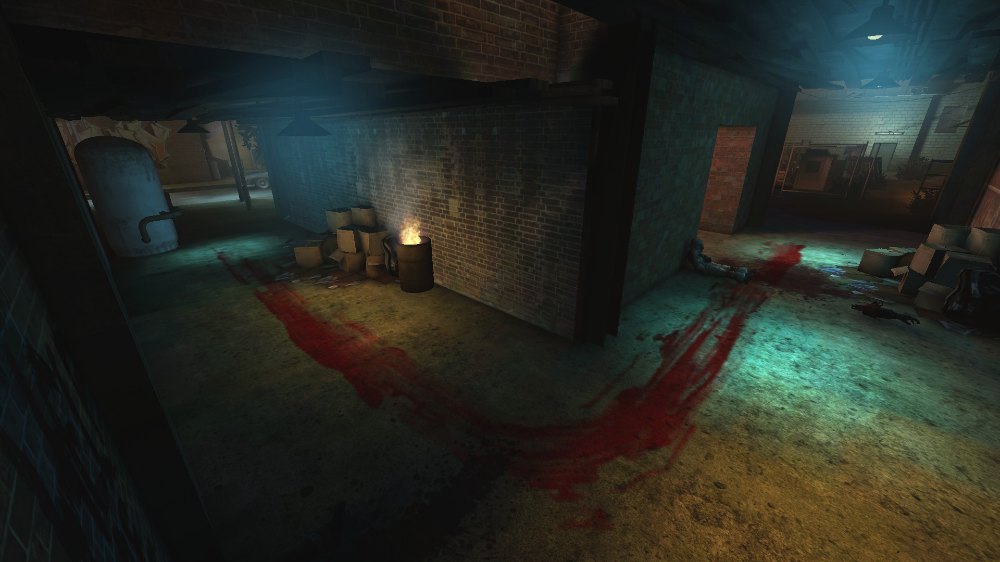

### Another perspective

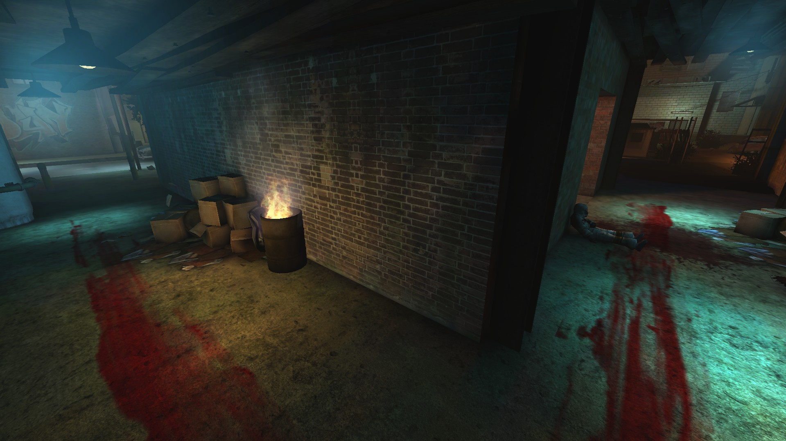

### End of the left side

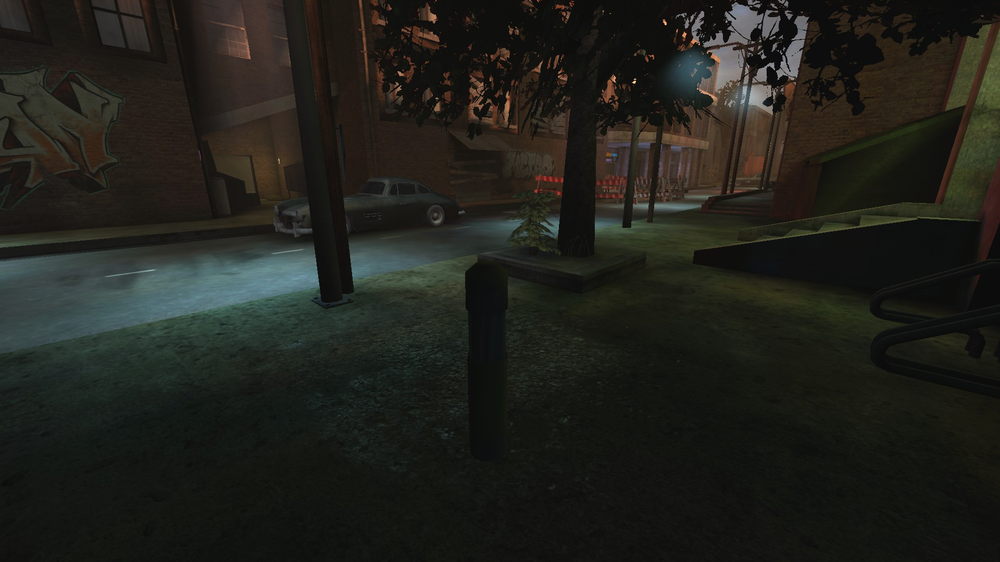

### Right side

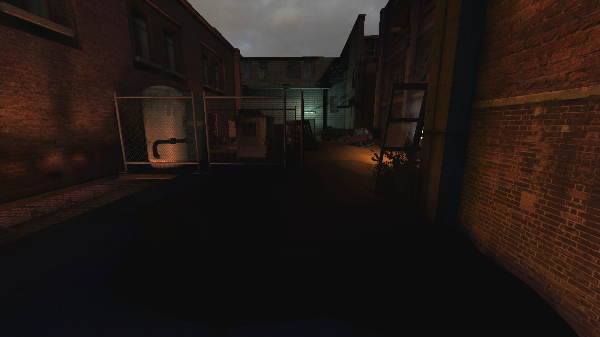

## #2, Basement

### Left side

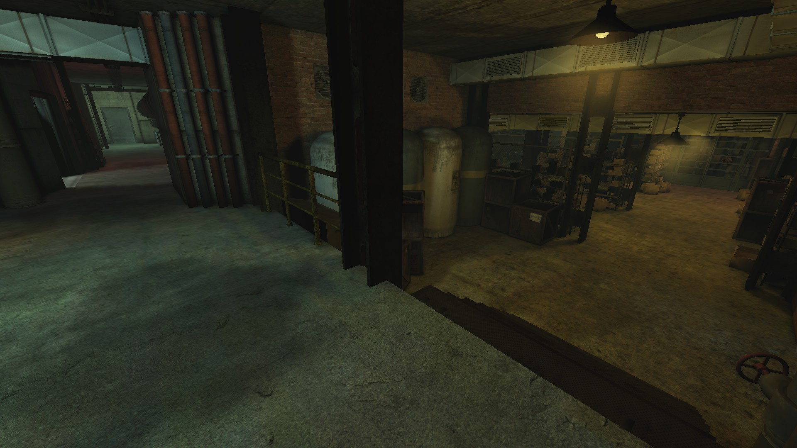

### Right Side

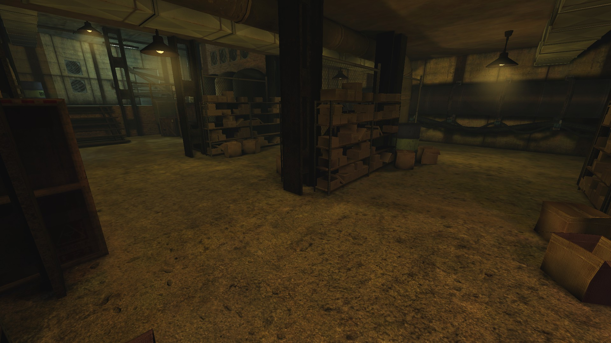

## #3, The 4-way intersection

### Overview

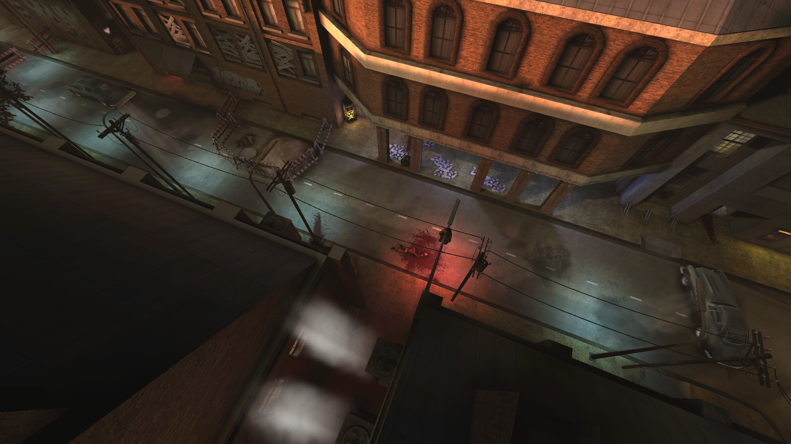

### View on the front alley

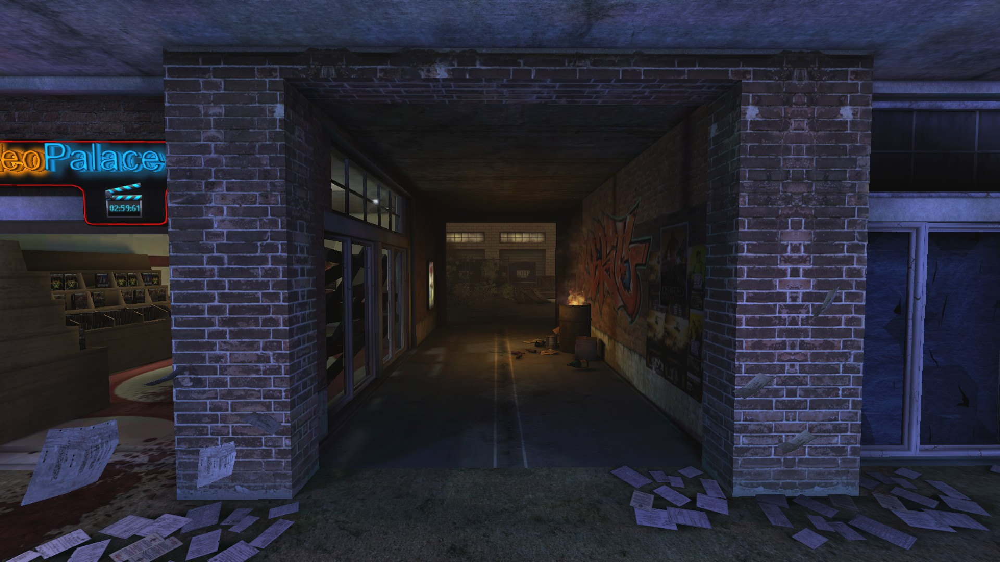

### View on the back alley

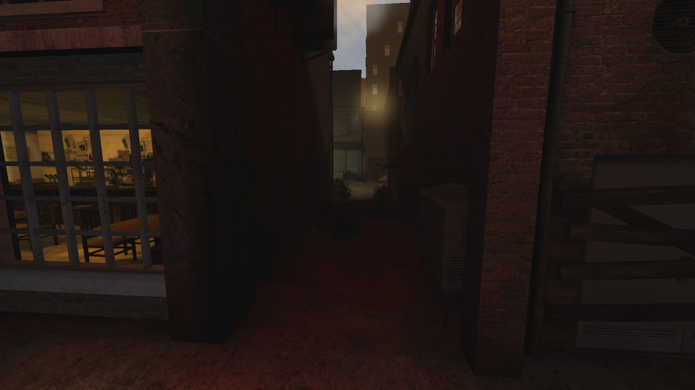

### View on the left side

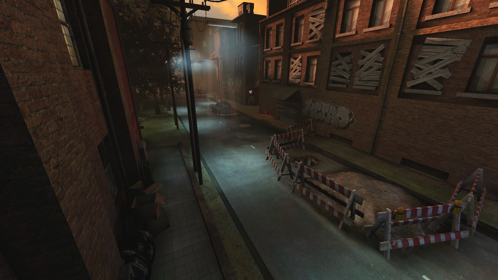

### View on the right side

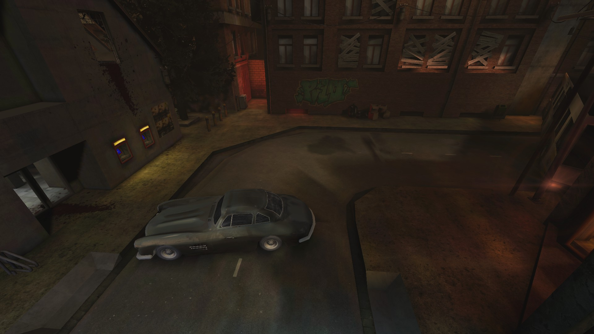
