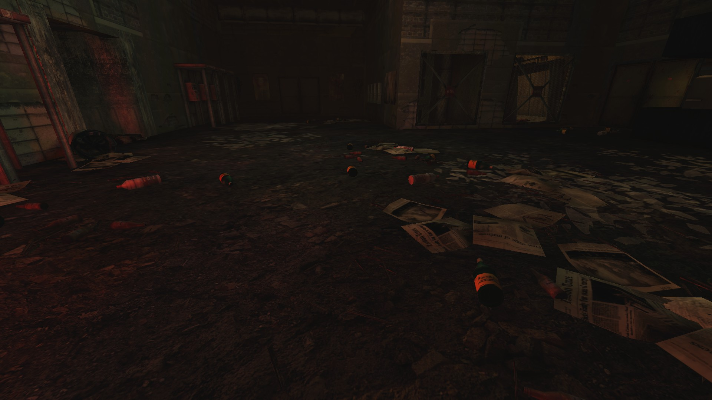
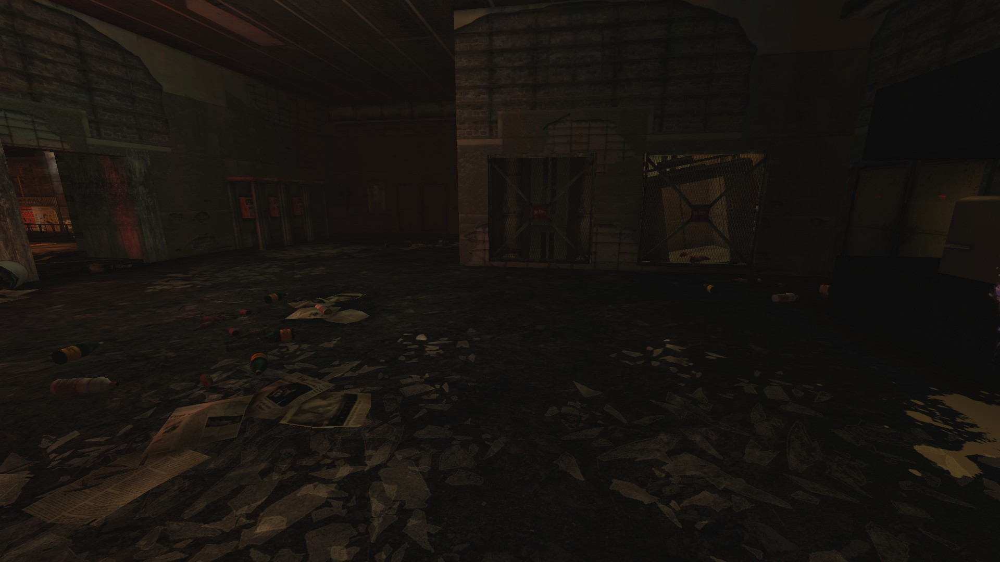
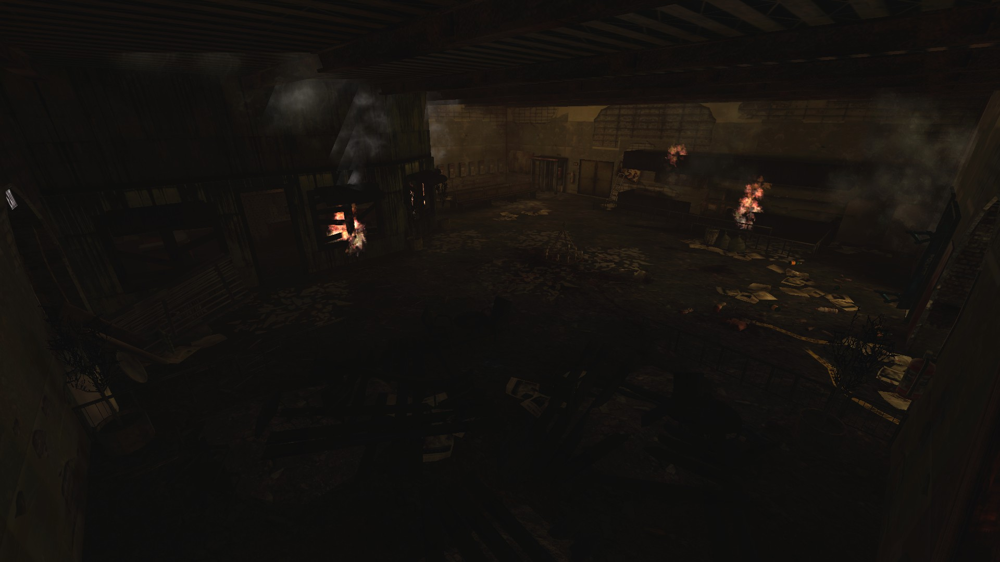
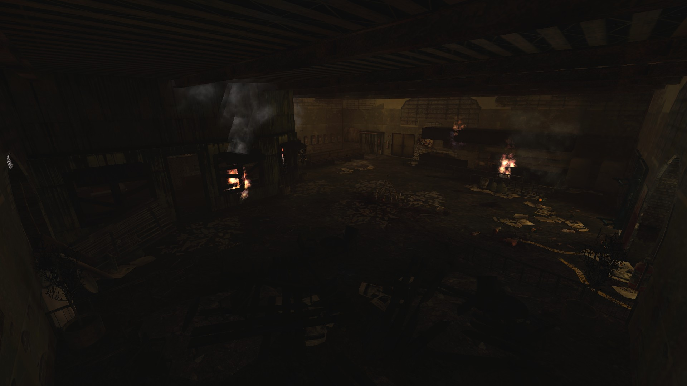
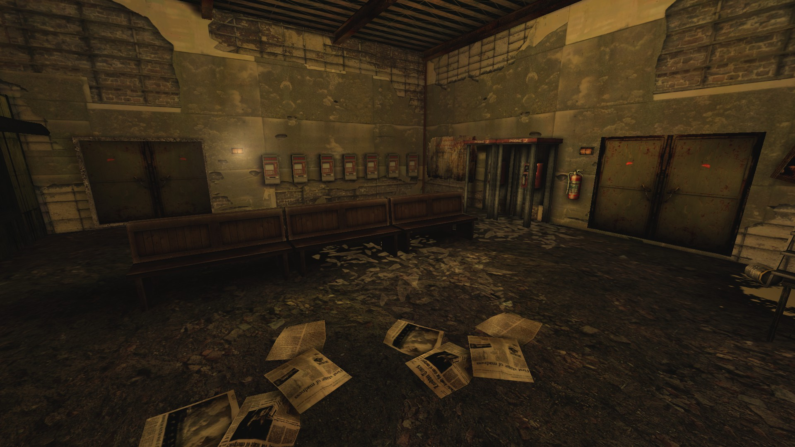
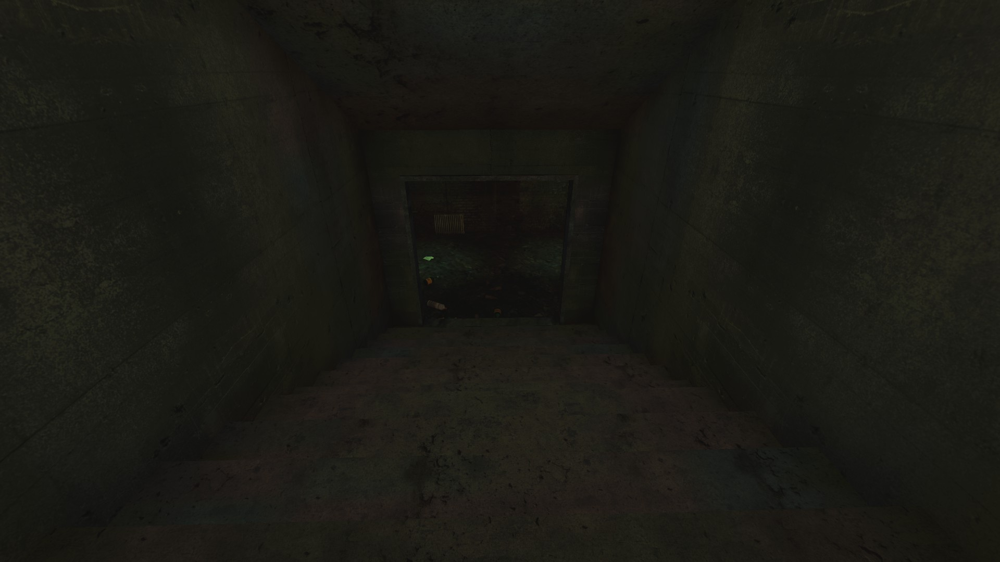
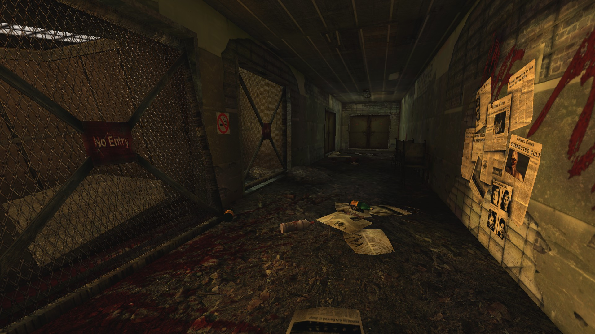

# Holdout Spots on Filth's Cross

## #1, Lobby of the building next to the spawnpoint

### Another perspective

## #2, Big room

### Overview

### Another perspective

Any of the double doors can be welded if necessary.

### Backdoors

The left set of backdoors in this picture needs to be welded.

View from the spot the right set of backdoors leads to.

## #3, The 2-way (Solo) spot

The team can spread out and cover both of the directions or stick together in front of both doorways.
