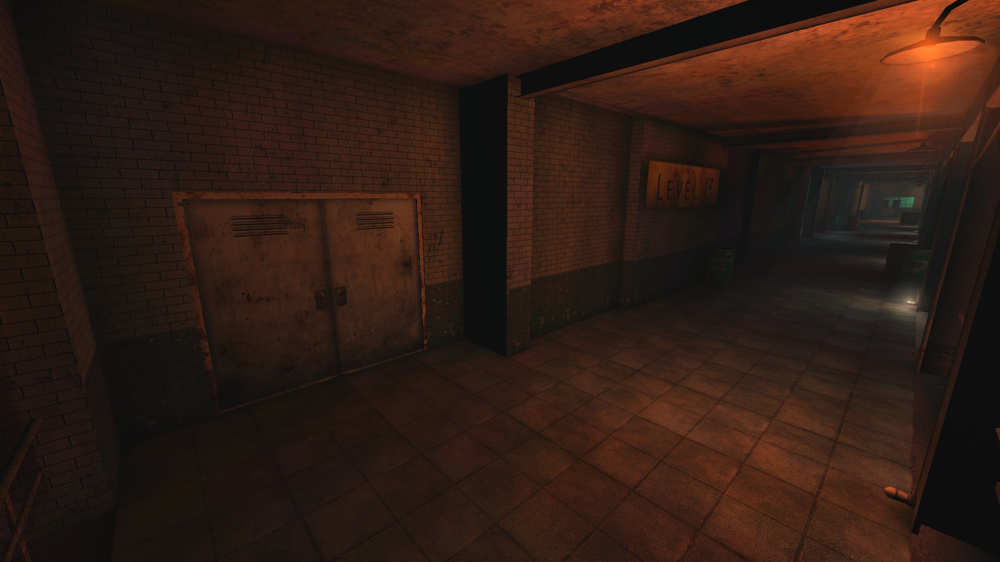
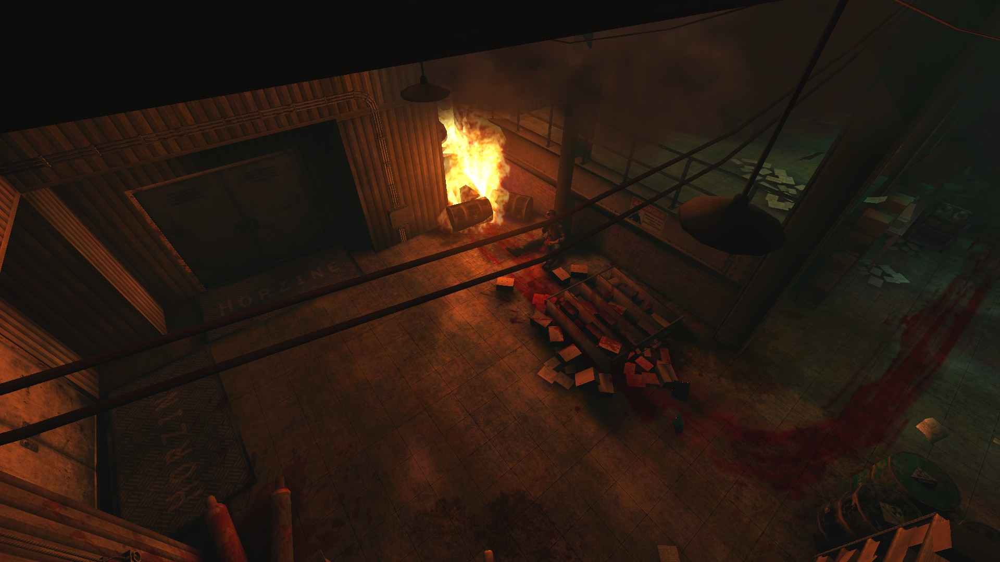
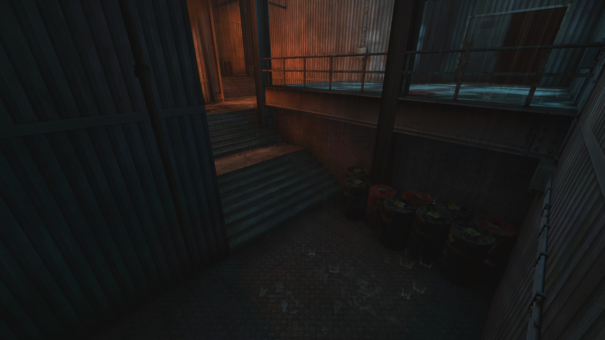
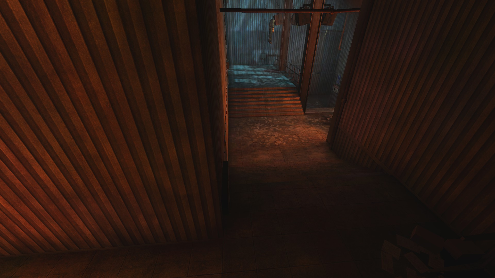
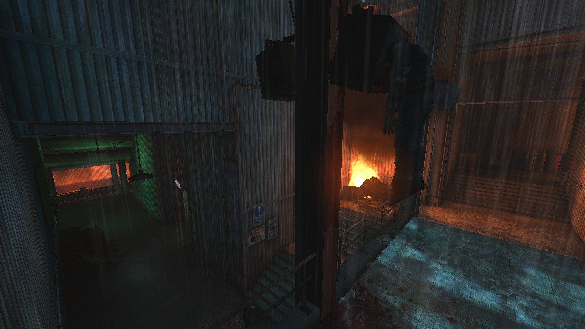
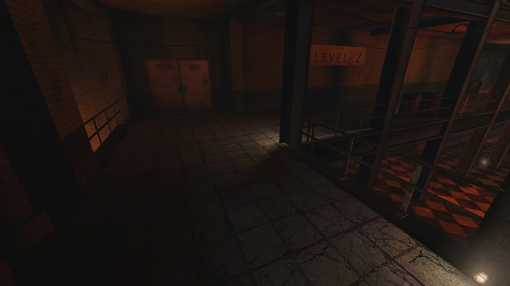

# Holdout Spots on Foundry

## #1, The classic level 3 (solo) spot

The double door on the left can be welded if necessary.

## #2, The "WinFoundry" intersection

Commonly used as a 2-way spot, with the central doorway welded shut.

## #3, The large 3-way intersection

### Overview

### View from the left side

### View from the right side

### #4, The Level 2 3-way intersection

