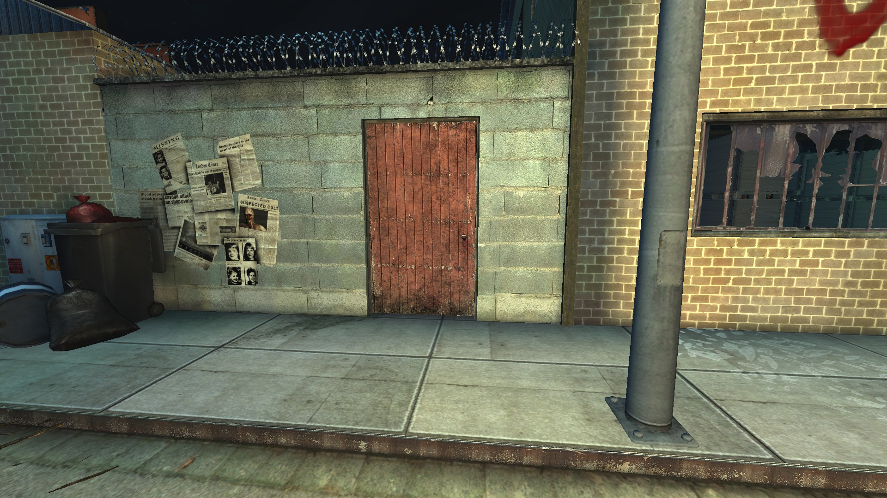

# Holdout Spots on Fright Yard

## #1, The classic 1-way (solo) spot on containers

## #2, The purple-lit canteen

### Overview

### Right doorway

### Hole in the middle wall

### Left doorway

## The KFO Gate

### Overview

### Door to weld

