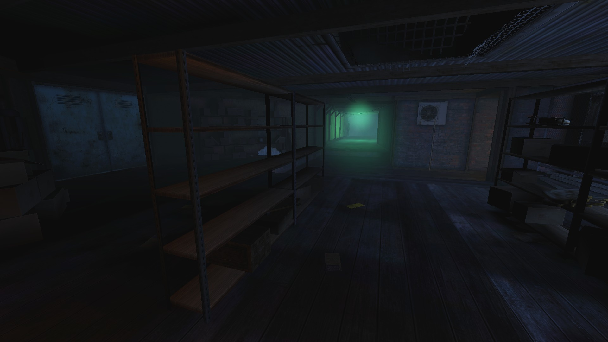
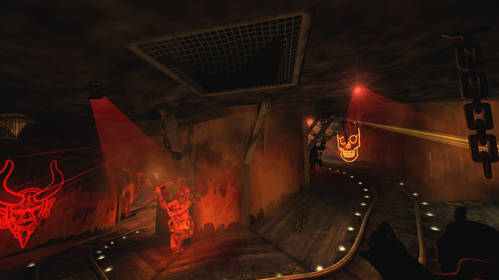
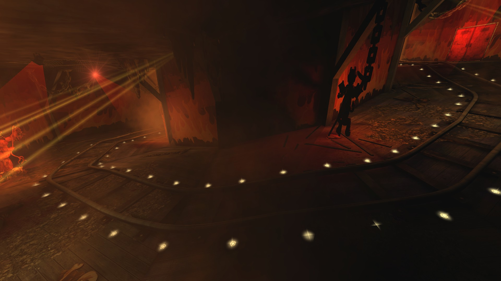
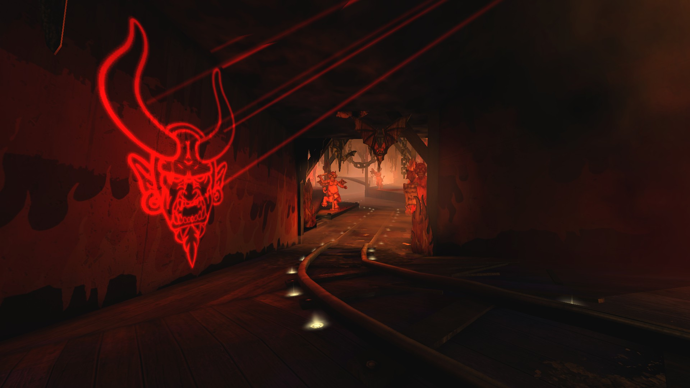
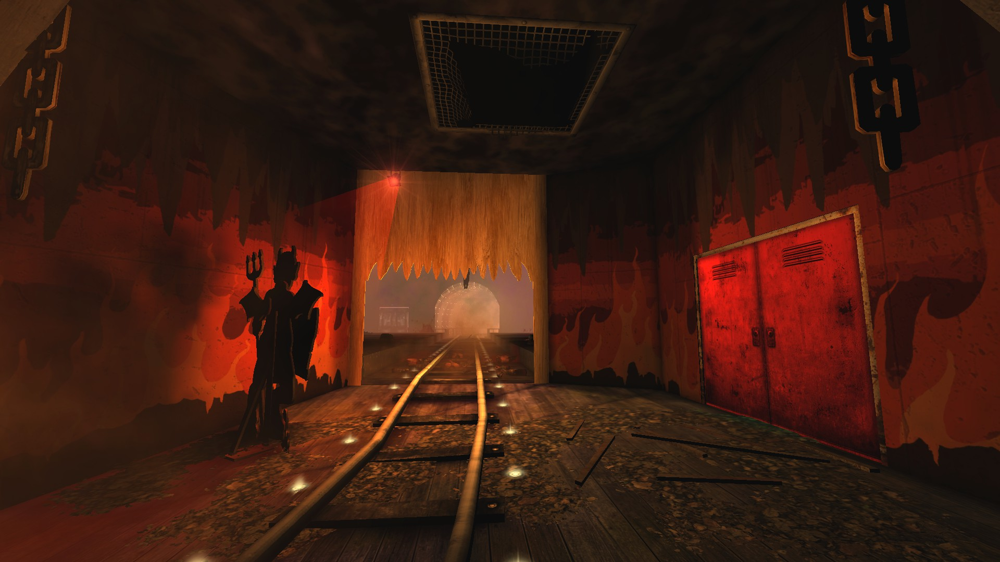

# Holdout Spots on Hellride

## #1, The 3-way spot in "Hell"

### Overview

### Front lane and side stairs

### Double Door on the right

The red-lit doors on the right side if the picture usually get welded.

### #2, The 2-way (solo) spot in "Heaven"

### Overview

The double door usually gets welded shut. This turns a 2-way spot into a 1-way spot.

### Another perspective - view from the front

### Another perspective - the end of the corridor

## #3, The 3-way spot in "Heaven"

### Overview

The double door on the left can be welded shut if necessary. This turns a 3-way spot into a 2-way spot.

### View on the orange-lit staircase

## #4, The tunnel in "Hell"

### Overview

Notice the ceiling spawn.

### Another perspective

### Left end

### Right end

