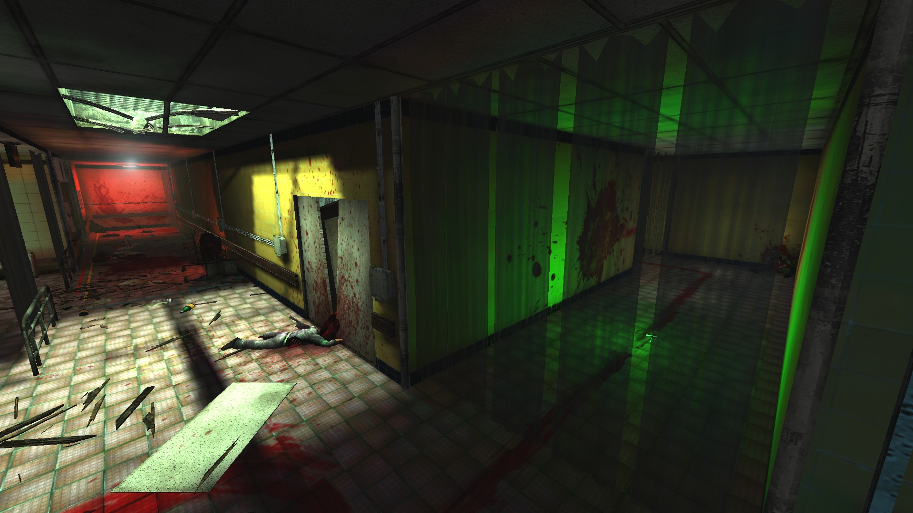
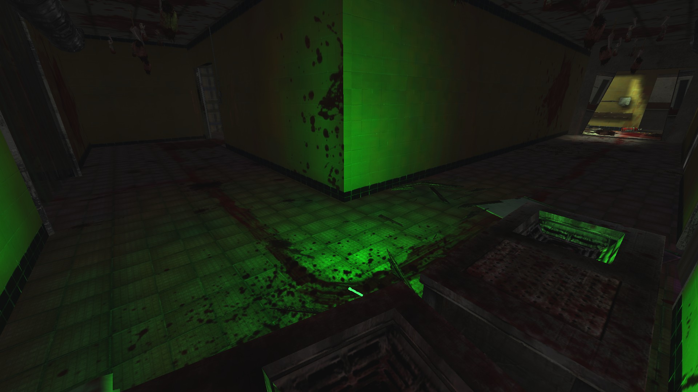
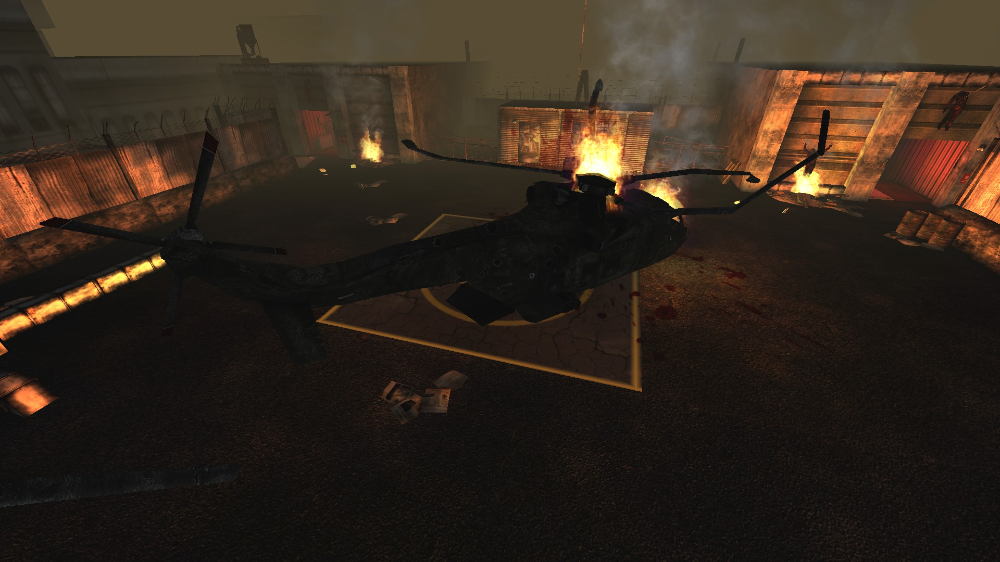
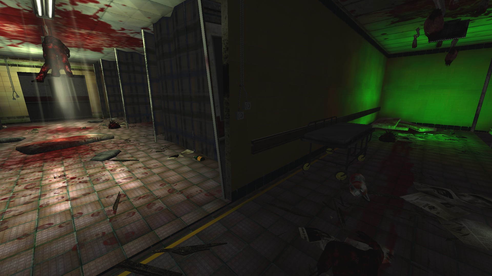
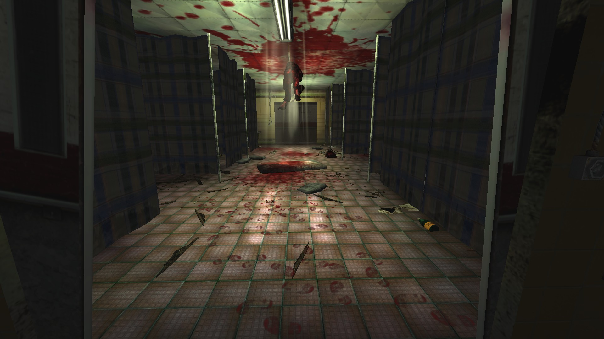
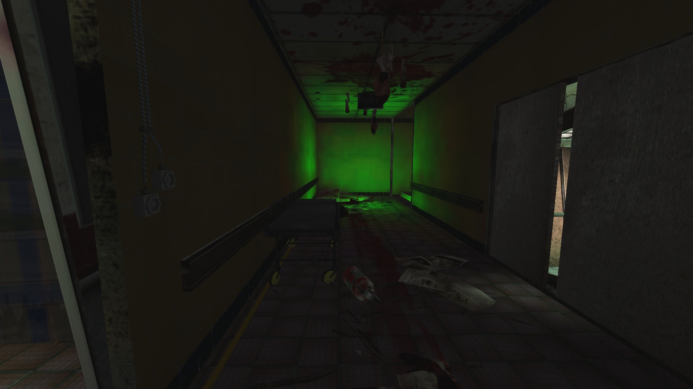
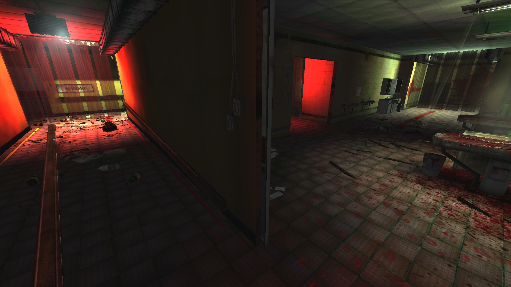
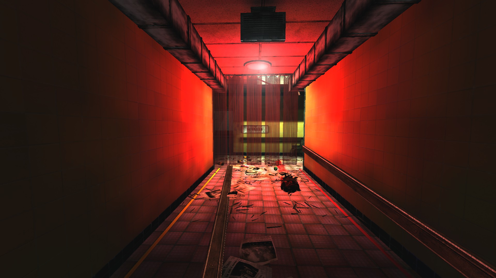
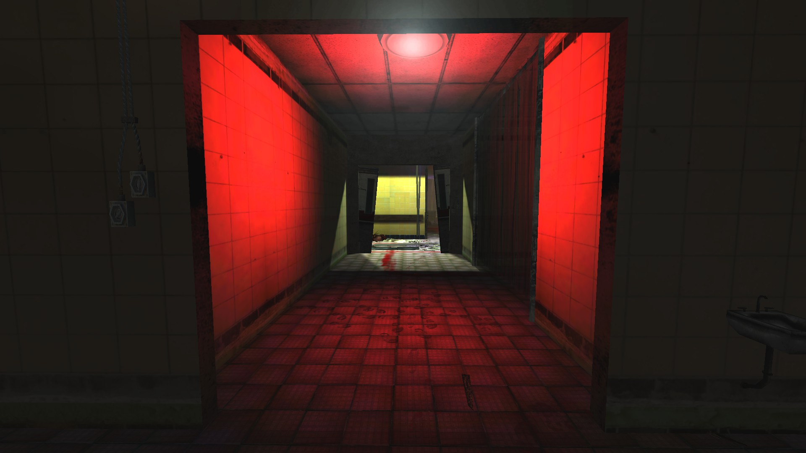
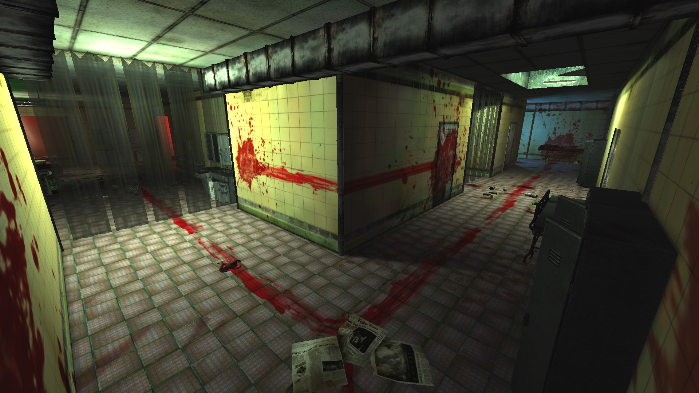

# Holdout Spots on Hospital Horrors

## #1, The 2-way intersection in the lobby

## #2, A corner with 2 green-lit lanes

## #3, The Roof

## #4, The 2-way Solo Spot

### Overview

### Main Lane

The main direction zeds come from.

If the player stands right in the intersection, behind the main lane (broken) doorway, there should be no spawns from the green-lit side.

## #5, The mortuary (2nd floor)

### Overview

### Left lane

### Cental lane

### Right lane

