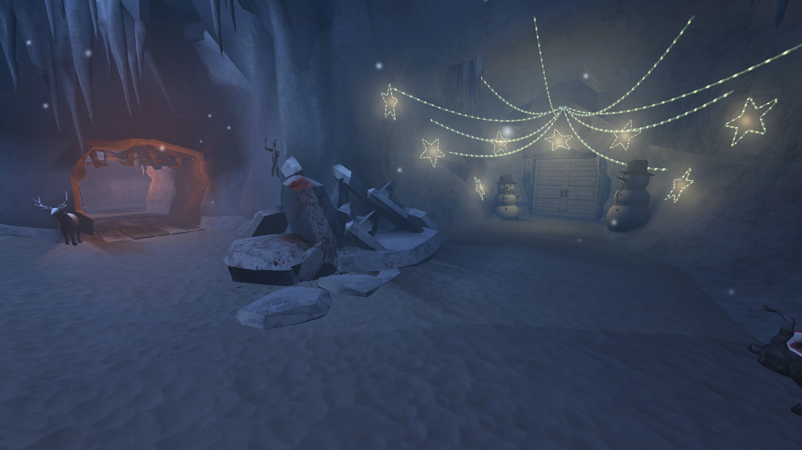
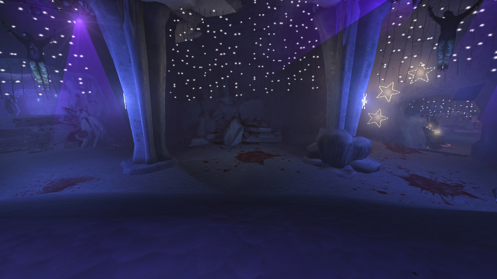

# Holdout Spots on Ice Cave

## #1, The classic spawn point intersection

### Overview

### Main lanes

### Backspawns

## #2, Large purple-lit cave

### Overview

### View from the left lane

### View from the right lane

Notice the hole in the right wall, it spawns trash zeds from time to time.

### The right lane diverges into 2 other lanes

### A ceiling spawn

## #3, A room with 2 entrances

Notice the ceiling spawn.
