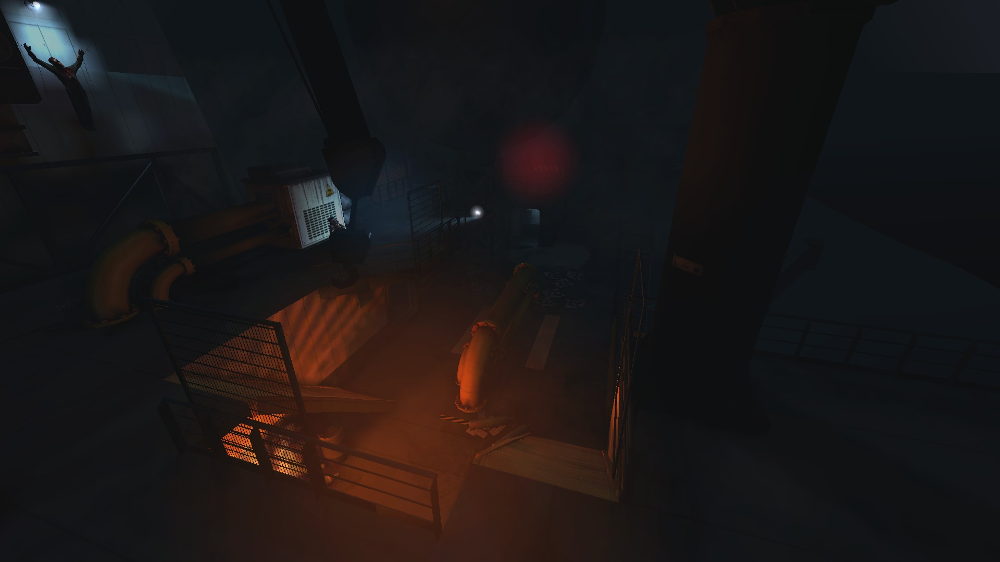
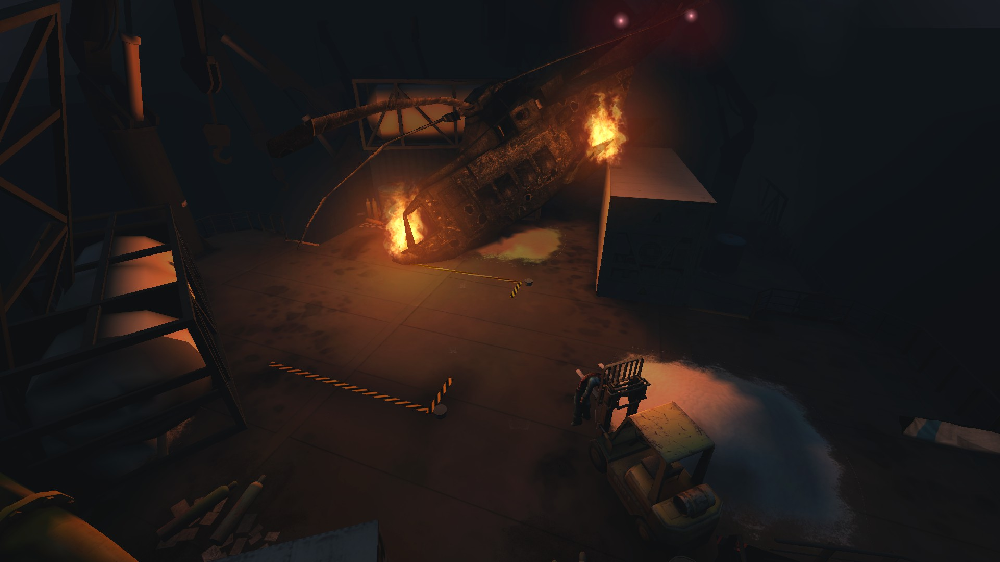

# Holdout Spots on Icebreaker

## #1, The 2-way spot next to the bow of the ship, right edge

## #2, The elevated platform with 2 sets of stairs

## #3, The ship's stern

A 2-way spot with a staircase in each lane.
