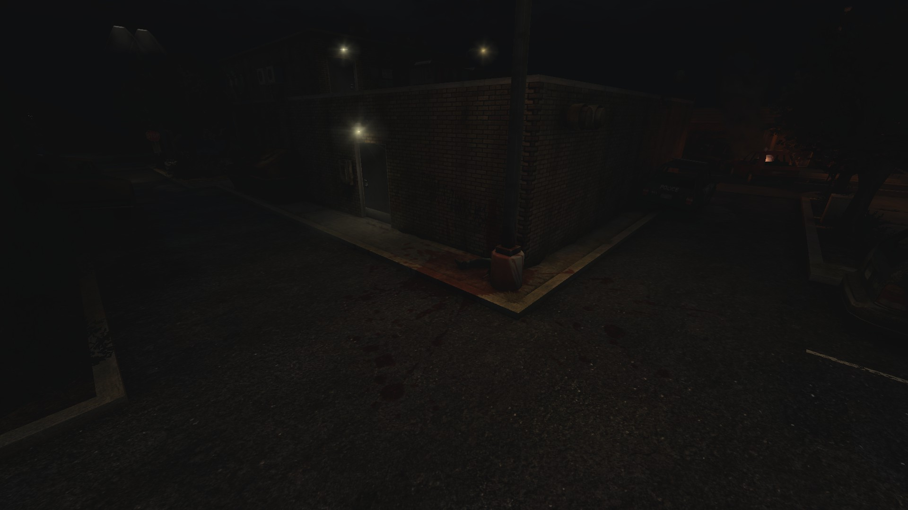
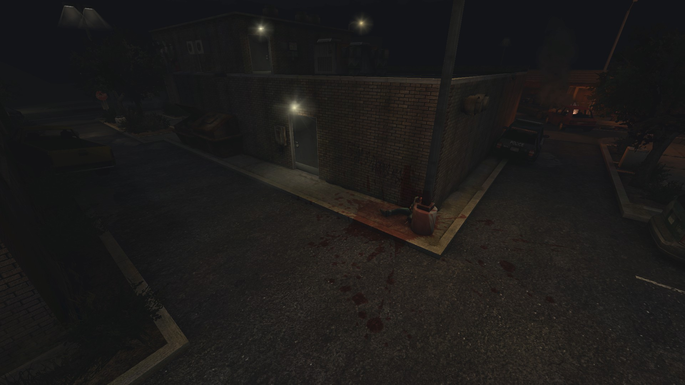
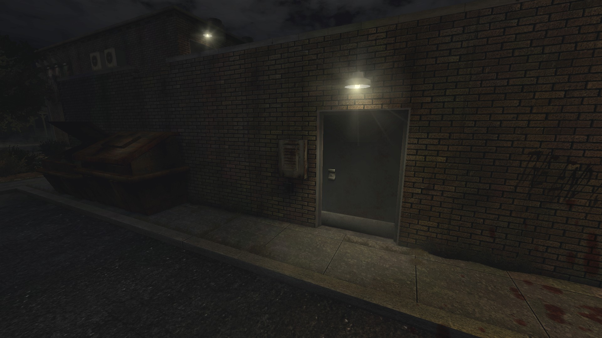
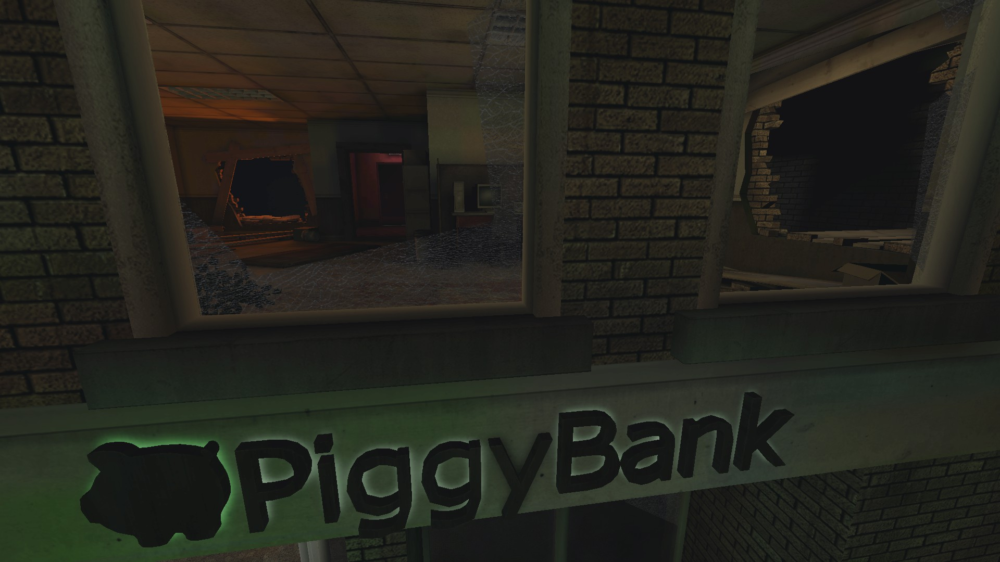
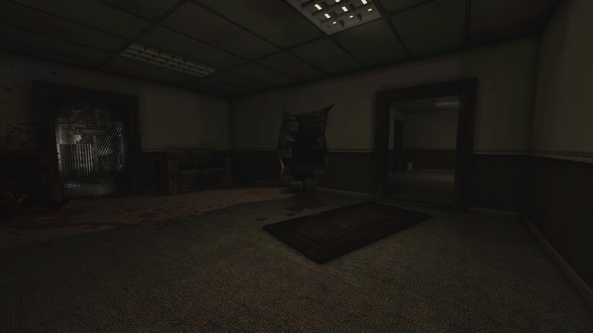
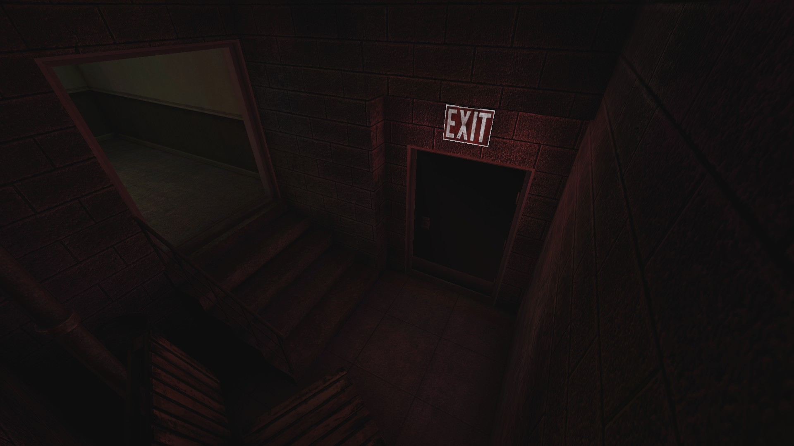

# Holdout Spots on Suburbia

## #1, The 2-way corner next to a trader room

### Overview

This map is quite dark, so I had to increase the gamma value to increase the visibility of each spot.

### A screenshot made with higher gamma value

### The solitary door usually gets welded shut

## #2, Piggy Bank - Top Floor

### View from the outside

### View from the inside

## #3, The 1-way spot inside a building on the right edge of the map (from the spawn)

### The front lane

Notice the hole in the wall which occasionally spawns trash zeds.

### The backdoor

This backdoor usually ends up welded shut and turns a 2-way spot into a 1-way spot.
