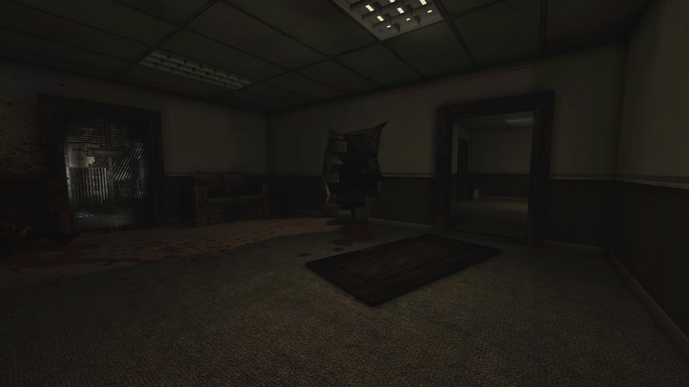
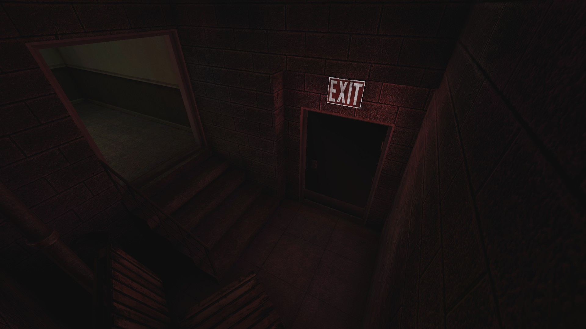

# Holdout Spots on Suburbia

## The 2-way corner next to a trader room

### Overview

### A screenshot made with higher gamma value

## The 2-way spot inside a building on the right edge of the map (from the spawn)

### The front lane

Notice the hole in the wall which occasionally spawns trash zeds.

### The backdoor

May or may not be welded according to the situation.
