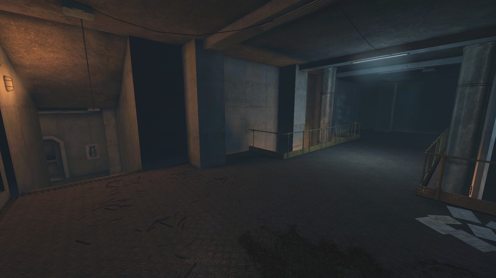

# Holdout Spots on Transit

## #1, 2nd floor, "WinTransit" spot, left end

### Overview

### Left side

### Right side

## #2, 2nd floor, "WinTransit" spot, right end

### Overview

### Right side

### Left side

## #3, The solo spot

### Overview

### Front lane

### Front lane - another perspective

### Front lane - another perspective

### Backdoor

### Backdoor - another perspective

Notice the ceiling spawn.

The backdoor can be welded if necessary.
