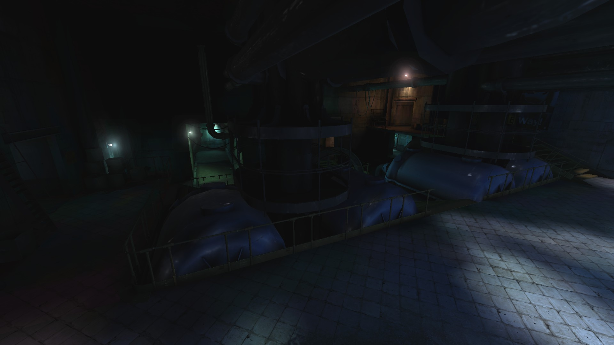
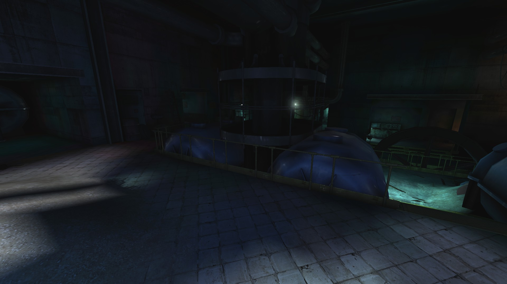
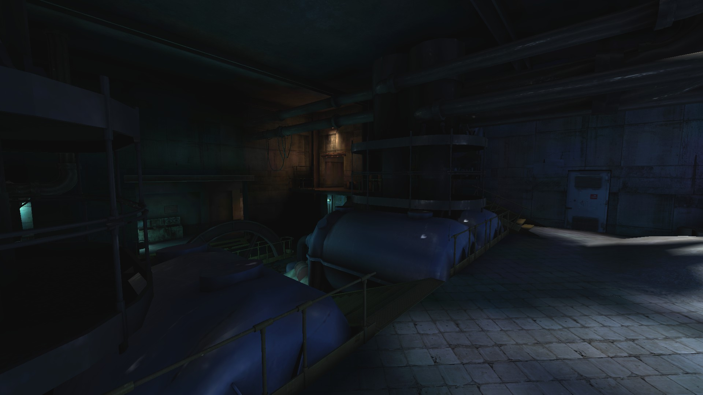
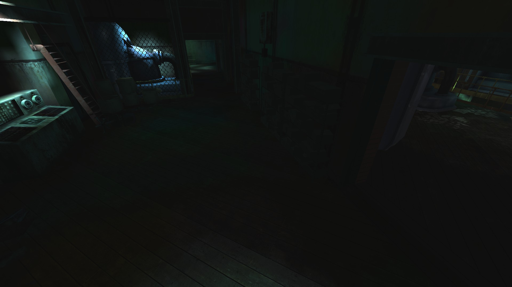
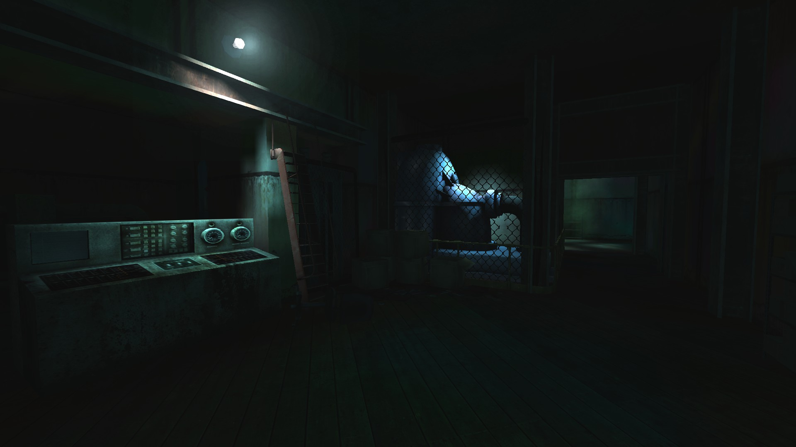
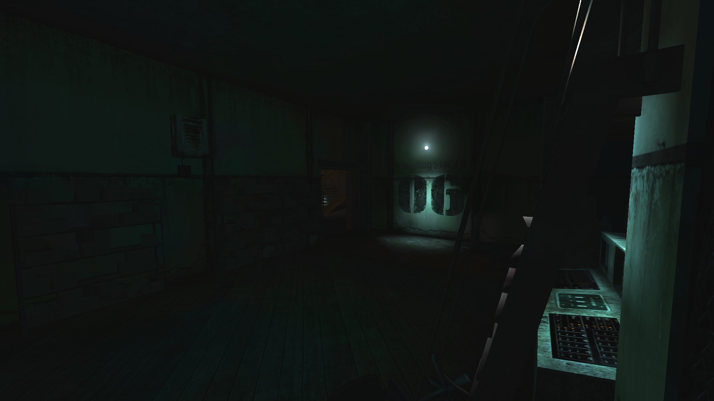
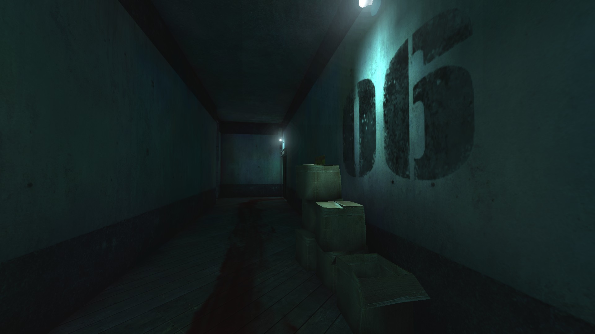
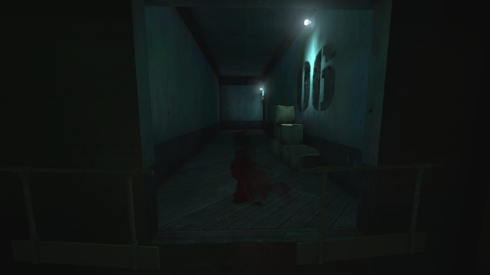
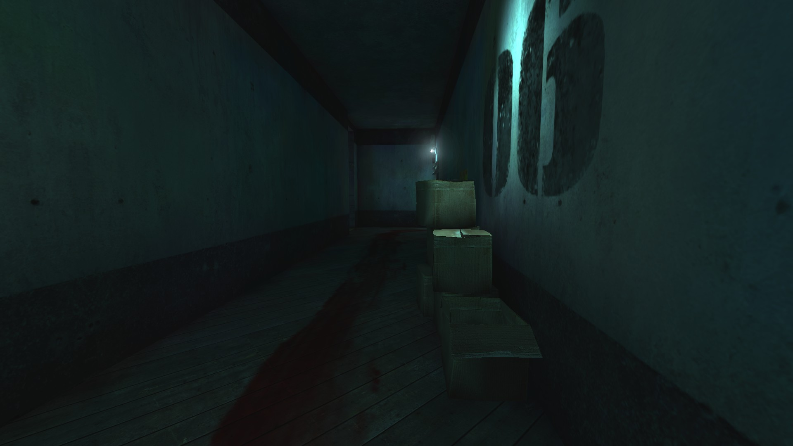
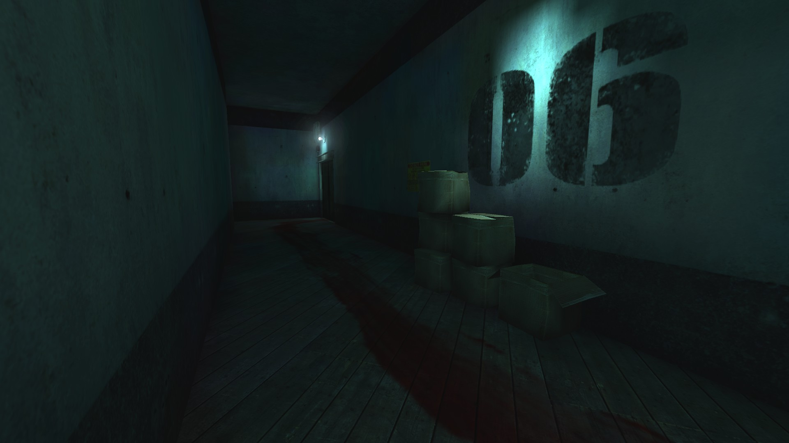

# Holdout Spots on Waterworks

## #1, The large 3-way spot

### Overview

### View on the central and left lanes

### View on the right lane (stairs)

## #2, Narrow 2-way spot, 2nd floor

### Overview

### View on the left side

### View on the right side

## #3, The 1-way (solo) corridor

### Overview

### Another perspective

### View on the left doorway

### View on the right doorway

