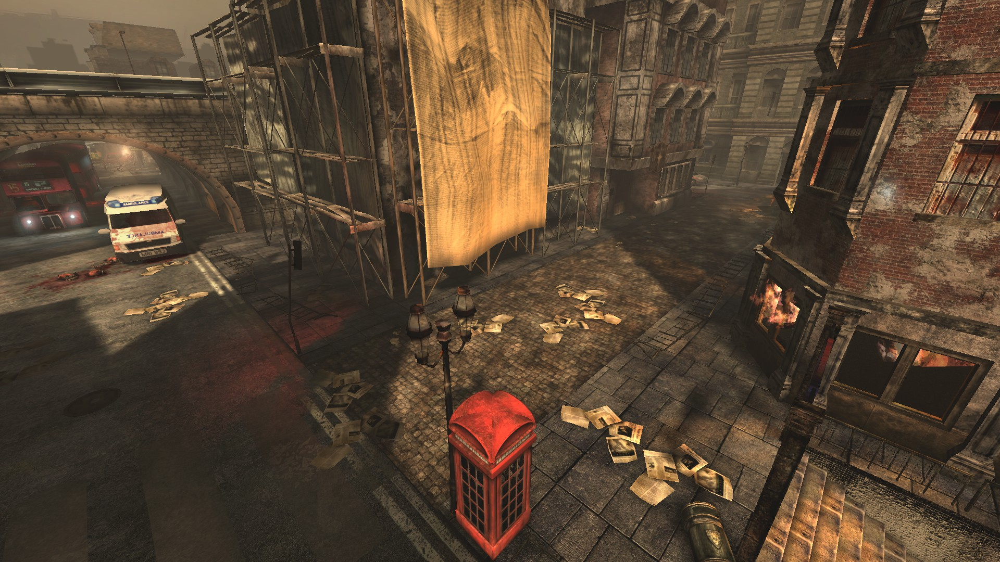

# Holdout Spots on West London

## #1, The classic 3-way spot in front of the church

### The church side

### The mid alley

### The police station side

### The church door to weld

It faces the police station and the entire long street. Welding it forces the zeds to come out of the other doorway, which is more convenient for holding the church side.

## #2, The 2-way tunnel spot next to the Police Station

## #3, The Police station corridor

The unlocked double door on the left usually gets welded shut.
