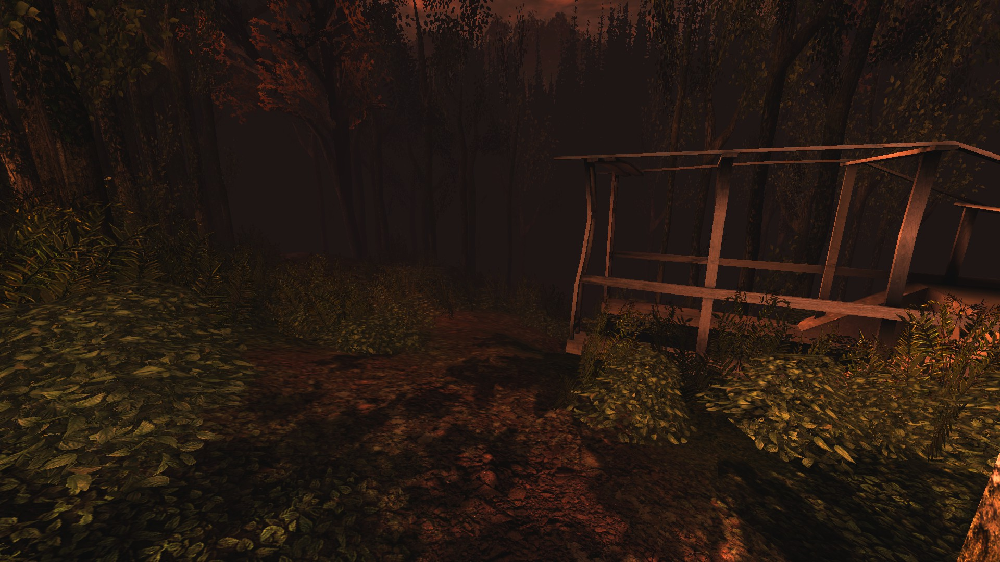
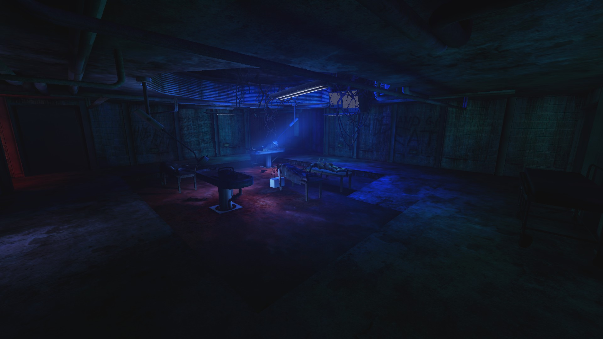

# Holdout Spots on Wyre

## #1, The classic underground (solo) spot

### Overview

### Another perspective

### Another perspective

### The backdoor

This backdoor is usually welded.

## #2, The 3-way hill, outdoors

### Overview

### The left lane

### The right lane

### The central lane

## #3, The 3-way underground spot

### Overview

### The cyan-lit front corridor

### The red-lit side corridor

### Backspawn

### The blue&cyan-lit rear corridor

### A closer look on this lane

### View on that corridor from inside - double door

### View on that corridor from inside - the bulletproof glass

## #4, Another solo spot

The left door usually gets welded.
